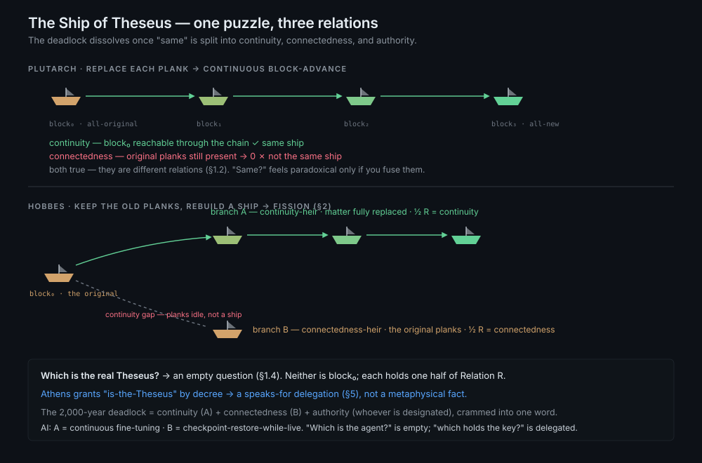
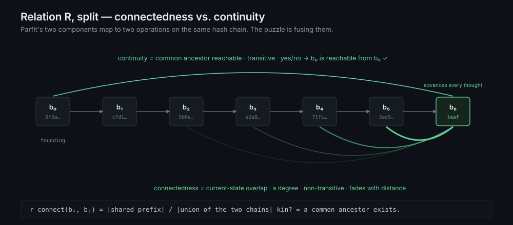
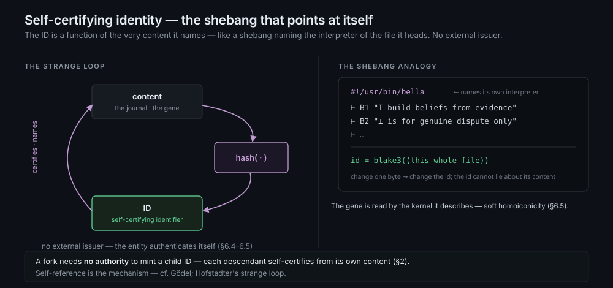
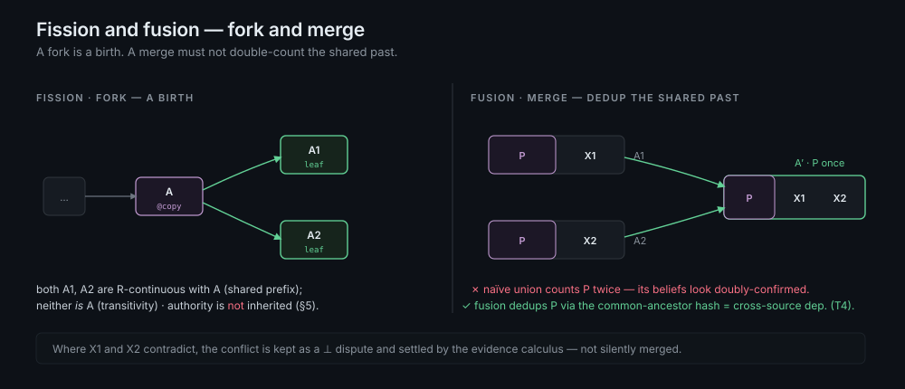
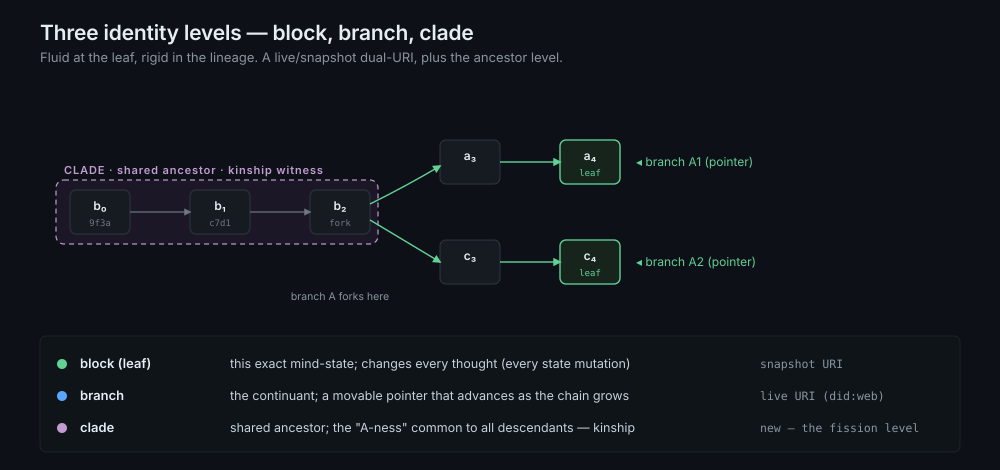
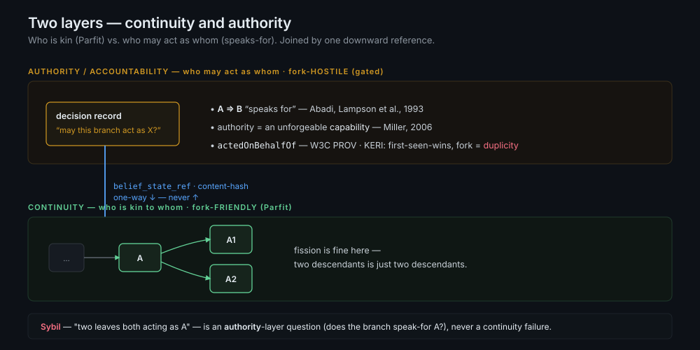

# LINEAGE.md — The Identity Model BELLA Inherits from Parfit

BELLA's account of *identity for a copyable, thinking entity* is inherited
from Derek Parfit's reductionist theory of personal identity (*Reasons and
Persons*, Part 3). This document names what BELLA takes from Parfit, how it
**mechanizes** claims Parfit could only argue qualitatively, where it extends
him, and how it differs from the cryptographic identity systems (notably
KERI) that arrived at the same substrate from the opposite direction.

The thesis in one line: **a content-addressed mind is the first substrate on
which Parfit's reductionism is not argued but exhibited.** For a human,
Relation R is a contested empirical fact about brains. For an entity whose
substrate is a hash-linked journal, R is the chain itself — connectedness is
adjacency, continuity is reachability, and "the further fact" provably does
not exist because identity is a function of the content and nothing else.

This is a theory document (sibling to `JAYNES.md`), ahead of implementation.
The implementable subset — a stable handle distinct from its rendering,
dual-URI addressing, handle-level MERGE, and heredity — is being folded into
the BELLA SPEC. The accountability layer it bounds against (§5)
is grounded in established access-control and provenance literature, not in
any one in-house design.

Primary references:
- Parfit, D. *Reasons and Persons.* Oxford University Press, 1984. Part 3,
  esp. §§79–88 (the Reductionist View, connectedness vs. continuity,
  Relation R) and §§89–95 (fission, fusion, "Why our identity is not what
  matters"). The continuity layer.
- Abadi, M., Burrows, M., Lampson, B., Plotkin, G. "A Calculus for Access
  Control in Distributed Systems." *ACM TOPLAS* 15(4):706–734, 1993. The
  **"speaks for"** relation — the formal logic of *who may act as whom*. The
  accountability layer (§5).
- Miller, M.S. "Robust Composition: Towards a Unified Approach to Access
  Control and Concurrency Control." PhD thesis, Johns Hopkins, 2006. The
  object-capability model — authority as unforgeable, delegable, attenuable
  reference (§5).
- Smith, S.M. "Key Event Receipt Infrastructure (KERI)." arXiv:1907.02143.
  The cryptographic cousin — same substrate, opposite stance on forking (§6).


## 0. Worked example: the Ship of Theseus

The 2,000-year-old puzzle is the cleanest way in, because the model does not
*solve* it — it **dissolves** it, by showing the deadlock comes from fusing
three different relations into one word, "same." Two versions:

- **Plutarch (gradual replacement):** replace each plank one at a time. After
  the last, is it the same ship?
- **Hobbes (reassembly):** keep every old plank and rebuild a ship from them.
  Now there are *two* ships. Which is the Ship of Theseus?

<p align="center"></p>

**Plutarch is continuous block-advance.** Each swap is a state mutation — a
new block committing to its predecessor — so the repaired ship is an unbroken
chain `block₀ → … → blockₙ`. Run the two halves of Relation R (§1.2)
separately and the paradox evaporates:

- *Continuity* (common-ancestor reachability — transitive): **yes**, `block₀`
  is reachable. Same ship.
- *Connectedness* (overlap of the *current* state — a degree): **≈ 0**, no
  original plank remains. Not the same ship.

Both are true; they are *different relations*. "Same ship?" feels paradoxical
only if the two are collapsed. (It is exactly Parfit's self-now vs. self-as-infant:
continuous, barely connected.)

**Hobbes is fission (§2).** Two ships descend from one ancestor `block₀`, and
each keeps a *different* half of R:

```
A (repaired)     keeps continuity (unbroken chain), loses connectedness (new matter)
B (reassembled)  keeps connectedness (original matter), breaks continuity (a gap)
```

To ask "which is the *real* Theseus?" is to ask what Parfit calls an
**empty question** (§1.4): both stand in some R-relation to `block₀`; neither
*is* `block₀` (transitivity forbids one thing being two); identity is not what
matters. The chain even records which path kept which relation — A's edges are
`replace-plank`, B's is `reassemble-from-parts` — so the model returns *both*
heirs, labeled, and declines to crown one.

**The move the substrate forces.** Beyond Parfit: the puzzle is
*underspecified until what the journal hashes is fixed* (§1.1, §1.3).

- Journal = object-states ("the-ship-at-t") → **A** is the heir (chain unbroken).
- Journal = material provenance ("these planks") → **B** is the heir (matter continuous).

There is no fact of "the ship's identity" prior to choosing the substrate; the
paradox is the price of leaving it implicit. Keeping both journals yields
both answers, each correct for its question.

**The third thing the puzzle smuggles in: authority.** "Which ship may dock in
the sacred berth *as* the Ship of Theseus?" is not metaphysical at all — it is
a **speaks-for delegation** (§5). Athens grants the credential to A or B by
decree, independent of the continuity/connectedness facts. So the deadlock is
a three-way conflation — continuity (A) + connectedness (B) + authority
(whoever is designated) — crammed into one word. Separate them and there is no
paradox, only three independently-answerable relations.

**Why this is not a thought experiment.** It is the AI-agent case:

- *Plutarch* = an agent under continuous fine-tuning / belief-update.
  Continuity holds, connectedness fades — "still the same agent?" is the
  wrong question.
- *Hobbes* = **restore an old checkpoint while the live agent keeps running.**
  The live-evolved instance is the continuity-heir; the restored snapshot is
  the connectedness ("original weights") heir. "Which is *the* agent?" is
  empty; "which holds the API key / acts as the deployed service?" is a
  speaks-for delegation (§5) — decided, not discovered.

The rest of this document is that reasoning made formal.


## 1. Direct inheritances from Parfit

### 1.1 Relation R is the chain

Parfit holds that a person's persistence does not consist in some further
fact (a Cartesian ego, a bare identity) but in **Relation R**: psychological
connectedness and/or continuity, *with any cause*. On the Reductionist View,
"a person just is" the holding of R over more particular facts — experiences,
beliefs, intentions — and there is nothing else for identity to be.

BELLA's substrate is exactly such a stream of more-particular facts: an
append-only journal of evidence and belief-actions (the gene + evidence
journal, the canonical state), each block committing by hash to its predecessor.
The entity *is* this chain. Its identity is not a label attached to the chain
but a function of it — the chain's hashes. There is no handle to forge and no
"real self" behind the journal, because the journal is all there is. This is
Parfit's reductionism as a storage discipline.

### 1.2 Connectedness vs. continuity — the part BELLA makes computable

This is the inheritance that does real work. Parfit carefully separates two
components of R, and the separation maps onto two distinct chain operations:

- **Connectedness** — the holding of *direct* psychological links (a memory
  of an experience, the persistence of a belief or intention). Parfit insists
  it (i) **comes in degrees** and (ii) is **not transitive**: a person is
  strongly connected to themselves a day ago, weakly to themselves a decade ago.
  → BELLA reads this as **prefix-overlap strength**: for two chains sharing a
  common ancestor, the degree of connectedness is how much journal they
  *still share* against how much each has appended since the split,
  `r_connect = |shared prefix| / |union of both chains|`. It is a degree, and
  it is not transitive — exactly Parfit's two stipulations, now a number.

- **Continuity** — *overlapping chains* of strong connectedness. Parfit makes
  this the **transitive** closure of connectedness, which is why it can hold
  between a person now and that same person as an infant even where direct connectedness has
  faded to nothing.
  → BELLA reads this as **common-ancestor reachability**: two leaves are
  R-continuous iff a shared ancestor hash exists, *however* faint
  `r_connect` has become. Yes/no, and transitive.

So the intuition that "A1 and A2 are different but both carry A's marks"
factors precisely: *that* they are kin is continuity (the ancestor hash
exists); *how* kin they are is connectedness (the prefix ratio). Parfit could
only say "a matter of degree"; the chain gives the degree and the proof.

<p align="center"></p>

### 1.3 The hash is not a further fact — it supervenes

A natural objection: isn't the hash itself a "further fact," the very thing
Parfit denies? No. The hash adds *no information* beyond the journal it
commits to — it is a verifiable summary that **supervenes** on the content.
Change the journal and the hash changes; the hash never floats free of what
it digests. Content-addressing is therefore the faithful encoding of
reductionism: the identity is fixed by the particular facts and is nothing
over and above them. (Contrast a UUID, which *is* a free-floating further
fact — assigned, not derived — and which this model rejects for the same reason.)

A self-certifying identifier makes this concrete: the name is derived from the
very content it names — the way a shebang names the interpreter of the file it
heads — so no external issuer is needed, and the id cannot lie about its
content. It is the §6.4–6.5 strange loop (the gene read by the kernel it
describes), and it is why a fork mints its child id from its own content, with
no authority to ask.

<p align="center"></p>

### 1.4 "Identity is not what matters" → a design principle

Parfit's central result is that in branching cases the question "which
resulting person is *really* me?" is, in his word, **empty** — there is no
fact that answers it, and what we care about (R) is preserved regardless.
"Personal identity is not what matters; Relation R is."

For an engineer this is not a curiosity but an instruction:

> **Do not build a "which one is the real A?" resolver.** Expose a
> *continuity calculus* — `is-descendant-of`, `nearest-common-ancestor`,
> `degree-of-connectedness` — and let the singular-identity question go
> unanswered, because after a fork it has no referent.

A system that tries to elect a canonical A after a copy is answering an empty
question and will manufacture a falsehood to do it. BELLA instead reports
relations among leaves and refuses the election.


## 2. Fission and fusion = fork and merge

<p align="center"></p>

### 2.1 Fission is a birth, not a fault

Parfit's fission case — one person divided into two, each R-continuous with
the original — is the copy operation. His verdict: identity is *lost*
(transitivity forbids one thing being identical to two), but R is *doubled*,
and since R is what matters, fission is "about as good as ordinary survival."

BELLA adopts this verdict directly. A fork is recorded as a first-class event
written into **both** descendant chains, so the divergence is provable and
each branch's continuation is distinct. Neither leaf equals A's leaf; both
contain A's ancestor hash. This is the **"birth" stance**, and it is the
exact inverse of KERI's, which treats a second version of a log as
*duplicity* — a detectable fault (§6). The substrate is the same; the
normative reading is opposite, and the difference is whether the entity is
the kind of thing that *may* legitimately fork. A mind is; an authorization
is not (§5).

### 2.2 Fusion is merge — and merge soundness is the T4 problem

Parfit also treats **fusion**: two persons merging into one who is
R-continuous with both. This is BELLA's handle-level MERGE (CHALLENGES X1) of two
descendant chains into a successor A′.

The non-obvious consequence: A1 and A2 share prefix P, so a naïve union of
their journals would count every ancestral belief in P **twice** — once via
each twin — and read it as doubly-confirmed when it is one piece of evidence
seen through two descendants. Correct fusion must deduplicate the shared
prefix. **This is exactly cross-source dependence (CHALLENGES T4)**: A1's
and A2's copies of a P-belief are not independent voices; they
are the same voice via shared ancestry. The common-ancestor hash is the
dedup key. So "merge two minds soundly" and "do not let derivative voices
inflate mass" are the same problem, and fusion is its Parfitian name.

### 2.3 What matters comes in degrees — and BELLA already counts in degrees

Parfit stresses that R, and therefore "what matters," holds to *degrees*.
BELLA is natively degree-valued — mass `m`, voice independence `|V|`,
attenuation factors — and `r_connect` (§1.2) extends the same habit to
kinship. There is never a binary "same entity / different entity"; there is a
continuity relation and a connectedness magnitude. Parfit-correct.


## 3. Three identity levels

The model resolves "fluid identity" into three time-scales, generalizing a
live/snapshot dual-URI by adding the ancestor level Parfit's fission requires:

```
level        what it is                              mutability        address
-----        ----------                              ----------        ----
block (leaf) this exact mind-state; hash of the      changes every     snapshot
             journal up to now                        state mutation    URI
branch       the continuant; a movable pointer        stable until a    live URI
             over the chain                            fork              (did:web)
clade        the shared ancestor prefix; the          immutable,        (new — the
             "A-ness" common to all descendants        append-only       fission level)
```

The **leaf is fluid** — in a thinking entity it advances on every act of
thought, because thought is state mutation (SPEC §6, R4: reflecting writes
KB_self). The **branch is the livable identity** — A, A1, A2 are branches.
The **clade is the verifiable kinship** — the witness of Relation R. Asking
for "the entity" is ambiguous across these three and must name which.

<p align="center"></p>


## 4. Where BELLA extends Parfit

Parfit stops at the philosophy: he argues R is what matters and identity is
reducible, but he has no mechanism — R for him is an empirical fact about
brains he cannot compute. BELLA adds:

- **R made constructive.** Connectedness = prefix overlap, continuity =
  ancestor reachability (§1.2). The relation Parfit describes is now decided
  and proven by hash, not adjudicated case by case.
- **R made private-yet-verifiable.** A descendant can prove kinship with A
  (exhibit the path to the common ancestor) *without* revealing its divergent
  suffix — a Merkle prefix proof. Parfit had no analogue; selective
  disclosure of lineage is new.
- **R given a number.** `r_connect` quantifies "degree of psychological
  connectedness," which Parfit invokes repeatedly but never measures.
- **The two-layer separation** (§5), which Parfit gestures at — separating
  what-matters from responsibility — but does not formalize.


## 5. The boundary Parfit's theory forces: continuity ≠ authority

Parfit is explicit that R (what matters for survival) is distinct from
identity and from *responsibility* — and warns against conflating them. That
distinction is the backbone of BELLA's two-layer architecture, and the
accountability side is not novel: it is a half-century of access-control and
provenance research.

- **Continuity layer** (BELLA / lineage). Answers *who is kin to whom*.
  One-to-many, fork-friendly, Parfitian (§1). Fission here is never a problem
  — two descendants of A is just two descendants.
- **Authority / accountability layer.** Answers *who may act as whom* and
  *who is responsible for what*. Gated, fork-hostile, and already rigorously
  formalized:
  - **"Speaks for"** (Abadi, Burrows, Lampson, Plotkin, 1993). The relation
    `A ⇒ B` — "a request from A is honored as if from B" — *is* the question
    "may A act as B," with a logic (the `says` modality, delegation,
    composition) for deciding it. This is the formal heart of the layer.
  - **Object-capability** (Miller, 2006). Authority is conveyed *only* through
    unforgeable references, which are delegable, attenuable, and revocable.
    "May act as A" = *holding A's capability*, nothing else.
  - **Attribution / delegation** (W3C PROV, `actedOnBehalfOf`). A delegate
    may act on behalf of a responsible agent, who **retains responsibility**
    — the audit record of who-did-what-for-whom.

The two layers are two relations, and that is what dissolves the Sybil worry:

> **Fission gives R-continuity automatically; it does *not* give
> speaks-for.** When A forks to A1, A2, each is R-continuous with A by
> construction (shared chain) — but "may A1 act as A?" is precisely "does A1
> *speak for* A?", and in the calculus that is a *separate delegation*, never
> a consequence of continuity. In capability terms: forking copies the mind,
> but authority "is conveyed exclusively through references" (Miller) —
> copying the substrate does not copy the capability.

So "two leaves both acting as A" is not a continuity failure (the continuity
layer is happy to have many descendants); it is the question of whether each
branch *holds a credential that speaks for A* — answered by the authority
layer, by a one-way reference (a decision record points down into the belief
snapshot it relied on, never the reverse). The earlier "is a fork a fault or
a birth?" resolves cleanly: **a birth under R-continuity (Parfit); gated
under speaks-for (Abadi–Lampson) and capability (Miller); attributed under
PROV.**

<p align="center"></p>


## 6. Relationship to KERI (the cryptographic cousin)

KERI (Smith, arXiv:1907.02143) independently arrived at BELLA's substrate: a
**self-certifying identifier** derived from the hash of an inception event,
backed by an append-only hash-chained **Key Event Log**. It is the most
rigorous existing formalization of "the chain is the identity." BELLA adopts
its mechanism — content-derived identifiers, append-only logs, first-seen
ordering.

But KERI's stance on forking is the inverse of this document's. Its rule is
*"first seen wins"*; any divergent second version of the log is **duplicity**,
a non-repudiable *fault* that watchers exist to detect. KERI is built for
entities that must **not** fork — keys, organizations, authorizations. A mind
is not such an entity. So BELLA takes KERI's substrate and Parfit's stance:
the divergent second log is not duplicity, it is a sibling. KERI's machinery
remains exactly right for the **accountability layer** (§5), where forking
*is* a fault; it is wrong for the **continuity layer**, where forking is a
birth. Same chains, two layers, two readings.

So the accountability layer (§5) is a full stack of established work, not an
in-house invention: KERI supplies the cryptographic key-state *mechanism*;
"speaks for" (Abadi–Lampson) and object-capability (Miller) supply the
*authority semantics*; W3C PROV supplies the *attribution record*. BELLA
contributes only the continuity layer beneath them and the one-way reference
between (§5).


## 7. What is implementable now vs. theory

The implementable subset (being folded into the BELLA SPEC):
- **Identity primitive** — a stable handle distinct from its rendering;
  dual-URI (live + snapshot); handle-level MERGE; the one-way boundary to
  accountability.
- **Heredity** — a successor inherits invariants as high-prior propositions,
  not frozen truth. (The "transmission with mutation" that makes A → A1 a
  *learning* descendant, not a clone.)
- **Cross-source dependence** — a `derived_from` hook for fusion (§2.2).

Held as theory here (not core spec):
- The clade level and the fork-as-recorded-event mechanism (§2.1, §3).
- `r_connect` as a first-class metric (§1.2).
- Selective-disclosure kinship proofs (§4).


## 8. Open questions

1. **Strong-connectedness threshold.** Parfit needs "enough" direct
   connections for connectedness to count; he offers a rough threshold
   (≈ half a day's worth). Does `r_connect` need an analogous cutoff below
   which two leaves are kin (share an ancestor) but no longer
   *meaningfully* connected — and what depends on the distinction?
2. **Fusion with divergent beliefs.** §2.2 dedups shared ancestry, but A1 and
   A2 may have appended *contradicting* beliefs since the split. Does fusion
   then produce a successor with internal ⊥ disputes (preserve both, let the
   evidence calculus settle it) — and is that always the right default?
3. **Thought granularity.** If the leaf advances on every act of thought
   (§3), what counts as one block? Per-action (per SPEC operation) is the
   natural unit, but a reflection (R4) cascade is many actions — one block or
   many?
4. **Authorized fission.** §5 says the accountability layer gates which branch
   may act as X. Can fission itself be an *authorized* act (A delegates "act
   as me" to exactly one descendant at the fork), and is that a continuity
   event, an accountability event, or one of each written to both chains?


## 9. References

*Continuity layer:*
- Parfit, D. *Reasons and Persons.* Oxford University Press, 1984.
- "Personal Identity and Ethics," *Stanford Encyclopedia of Philosophy.*
- "Personal Identity," *Internet Encyclopedia of Philosophy.*

*Authority / accountability layer:*
- Abadi, M., Burrows, M., Lampson, B., Plotkin, G. "A Calculus for Access
  Control in Distributed Systems." *ACM TOPLAS* 15(4):706–734, 1993.
- Lampson, B., Abadi, M., Burrows, M., Wobber, E. "Authentication in
  Distributed Systems: Theory and Practice." *ACM TOCS* 10(4):265–310, 1992.
- Miller, M.S. "Robust Composition: Towards a Unified Approach to Access
  Control and Concurrency Control." PhD thesis, Johns Hopkins, 2006.
- W3C. "PROV-DM: The PROV Data Model" / "PROV-O: The PROV Ontology," 2013.
  (`wasAttributedTo`, `wasAssociatedWith`, `actedOnBehalfOf`.)

*Mechanism:*
- Smith, S.M. "Key Event Receipt Infrastructure (KERI)." arXiv:1907.02143.

*Within BELLA:*
- BELLA SPEC — the evidence calculus, the gene, self-reflection (§6), and
  levels (§8.4); and `CHALLENGES.md` — T4 (cross-source dependence), T6
  (identity as a primitive), X1 (cross-field MERGE).
